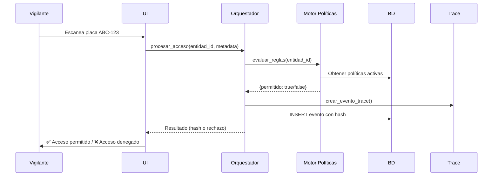
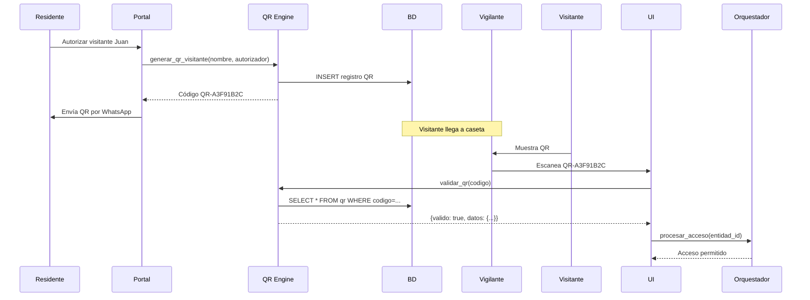

# Arquitectura AX-S
## Sistema de Control de Accesos - AUP-EXO

---

## 📐 Visión General

**AX-S** está construido sobre la **Arquitectura Universal Plataforma - Experiencia Optimizada (AUP-EXO)**, un patrón de diseño que permite escalabilidad sin refactoring mediante:

1. **Modelo Universal de Entidades**
2. **Orquestador Central**
3. **Políticas Parametrizadas**
4. **Trazabilidad Blockchain-Style**
5. **Analítica Estructural**

---

## 🏗️ Capas de la Arquitectura

### 1. **Capa de Presentación** (`app/views/`)

Interfaces de usuario construidas con Streamlit:

```
views/
├── dashboard.py                 # Dashboard analítico principal
├── vigilancia_gatekeeper.py     # Control de accesos (vigilante)
├── entidades.py                 # Gestión de entidades
├── visitas.py                   # Gestión de visitantes
├── proveedores.py               # Administración de proveedores
├── qr.py                        # Generación de códigos QR
├── emergencias.py               # Registro de emergencias
├── politicas.py                 # Configuración de políticas
├── analitica.py                 # Análisis avanzado
└── administracion.py            # Configuración del sistema
```

**Responsabilidad**: Capturar input del usuario y mostrar información.

---

### 2. **Capa de Lógica de Negocio** (`app/core/`)

Motores que implementan la lógica AUP-EXO:

```
core/
├── orchestrator.py          # Orquestador central de accesos
├── policy_engine.py         # Motor de evaluación de políticas
├── trace.py                 # Generación de eventos con trazabilidad
├── qr_engine.py             # Generación y validación de QR
├── visitor_engine.py        # Gestión de visitantes y folios
├── provider_engine.py       # Proveedores recurrentes
├── emergency_engine.py      # Accesos de emergencia
└── analytics.py             # Analítica T-1 vs T0
```

**Responsabilidad**: Implementar reglas de negocio, validaciones y procesos.

#### 2.1 **Orquestador Central** (`orchestrator.py`)

```python
class OrquestadorAccesos:
    def procesar_acceso(entidad_id, metadata, actor, dispositivo):
        # 1. Evaluar políticas
        evaluacion = evaluar_reglas(entidad_id, metadata)
        
        # 2. Registrar evento
        if evaluacion['permitido']:
            return registrar_acceso('entrada', ...)
        else:
            return registrar_acceso('rechazo', ...)
```

**Flujo**:
```
Usuario → UI → Orquestador → Políticas → Evento → BD
```

#### 2.2 **Motor de Políticas** (`policy_engine.py`)

Evalúa reglas configurables:

```python
def evaluar_reglas(entidad_id, metadata):
    politicas = _obtener_politicas_activas()
    
    for politica in politicas:
        # Verificar horarios
        # Verificar límites de visitas
        # Verificar autorizaciones
        # Verificar lista negra
        ...
    
    return {"permitido": True/False, "motivo": "..."}
```

**Tipos de Políticas Soportadas**:
- ⏰ Restricciones de horario
- 📊 Límites de visitas por día
- ✅ Autorización previa requerida
- 🚫 Lista negra
- 📅 Restricciones por día de semana

---

### 3. **Capa de Datos** (`app/models/` y `app/database/`)

#### 3.1 Modelo Universal de Entidades

**Tabla: `entidades`**
```sql
CREATE TABLE entidades (
    entidad_id TEXT PRIMARY KEY,
    tipo TEXT,              -- persona, vehiculo, visitante, proveedor
    atributos JSON,         -- Flexible: nombre, placa, folio, etc.
    estado TEXT,            -- activo, inactivo, bloqueado
    created_at TIMESTAMP,
    updated_at TIMESTAMP
);
```

**Ventajas**:
- Agregar nuevos tipos sin cambiar schema
- Atributos parametrizables por tipo
- Un solo punto de búsqueda

#### 3.2 Eventos con Trazabilidad

**Tabla: `eventos`**
```sql
CREATE TABLE eventos (
    evento_id INTEGER PRIMARY KEY,
    entidad_id TEXT,
    tipo_evento TEXT,       -- entrada, salida, rechazo, alerta
    metadata JSON,
    hash_actual TEXT,       -- SHA-256 del evento
    hash_previo TEXT,       -- Encadenamiento blockchain-style
    actor TEXT,
    dispositivo TEXT,
    timestamp_servidor TIMESTAMP
);
```

**Cadena de Hash**:
```
Evento 1: hash_previo=NULL,     hash_actual=abc123
Evento 2: hash_previo=abc123,   hash_actual=def456
Evento 3: hash_previo=def456,   hash_actual=ghi789
```

#### 3.3 Políticas Parametrizadas

**Tabla: `politicas`**
```sql
CREATE TABLE politicas (
    politica_id TEXT PRIMARY KEY,
    nombre TEXT,
    descripcion TEXT,
    tipo TEXT,              -- horario, limite, autorizacion
    condiciones JSON,       -- Configuración flexible
    prioridad INTEGER,
    estado TEXT,            -- activa, inactiva
    aplicable_a TEXT        -- global, persona, vehiculo, proveedor
);
```

---

### 4. **Capa de Servicios** (`app/services/`)

Integraciones con sistemas externos:

```
services/
├── notifications.py         # Email, SMS, WhatsApp
├── resident_portal.py       # API para portal auto-servicio
└── integration_recordia.py  # Enlace a Recordia Bridge
```

---

### 5. **Capa de Seguridad** (`app/security/`)

```
security/
├── auth.py                 # Login, tokens JWT
└── permissions.py          # Permisos por rol
```

**Roles**:
- `admin` - Acceso completo
- `supervisor` - Dashboard + configuración de políticas
- `vigilante` - Solo control de accesos
- `residente` - Solo portal auto-servicio (futuro)

---

## 🔄 Flujos Principales

### Flujo 1: Registro de Acceso



### Flujo 2: Generación de QR para Visitante



### Flujo 3: Detección de Anomalías

```mermaid
sequenceDiagram
    Scheduler->>Analytics: Ejecutar cada hora
    Analytics->>BD: SELECT eventos últimas 24h
    Analytics->>comparar_t1_t0(): Comparar hoy vs ayer
    Analytics->>detectar_anomalias(): 4 tipos de anomalías
    Analytics->>etiquetar_eventos(): Etiquetar riesgo
    Analytics->>BD: Guardar métricas
    Analytics->>Notifications: Enviar alertas si hay anomalías altas
```

---

## 📊 Principios de Diseño

### 1. **Todo es una Entidad**
No hay tablas separadas para personas, vehículos, visitantes. Todo es `entidad` con `atributos` JSON flexibles.

### 2. **Todo Genera un Evento**
Cada acción (entrada, salida, rechazo, alerta) genera un evento con hash.

### 3. **Todo Pasa por el Orquestador**
No hay acceso directo a BD desde UI. Todo fluye por `OrquestadorAccesos`.

### 4. **Políticas sin Deployment**
Cambiar reglas de negocio no requiere deployment. Todo se configura en BD.

### 5. **Trazabilidad Inmutable**
La cadena de hash hace imposible alterar eventos pasados sin detectarse.

---

## 🚀 Escalabilidad

### Crecimiento Horizontal

```
AX-S puede escalar de:
1 condominio → 10 condominios → 100 condominios
```

**Sin cambios en código**:
- Agregar más workers (Streamlit/FastAPI)
- Migrar a PostgreSQL/Supabase
- Cachear políticas en Redis
- CDN para evidencias (HotVault)

### Modelo Multi-Tenant

```
BD: condominios
├── condominio_1 (entidades, eventos, políticas)
├── condominio_2 (entidades, eventos, políticas)
└── condominio_N (entidades, eventos, políticas)
```

---

## 🔗 Integración con Ecosistema AUP-EXO

| Sistema | Función | Estado |
|---------|---------|--------|
| **Recordia** | Trazabilidad jurídica certificada | ⏳ Futuro |
| **HotVault** | Almacenamiento inmutable de evidencias | ⏳ Futuro |
| **CRM-EXO** | Gestión de residentes y comunicación | ⏳ Futuro |
| **Oyente** | Transcripción de llamadas | ⏳ Futuro |

---

## 📁 Estructura de Archivos Completa

```
AX-S/
├── app/
│   ├── core/              ✅ Lógica de negocio AUP-EXO
│   ├── models/            ⏳ Modelos de datos (próximamente)
│   ├── database/          ⏳ Conexión y migraciones
│   ├── security/          ⏳ Auth y permisos
│   ├── utils/             ⏳ Utilidades generales
│   ├── services/          ⏳ Integraciones externas
│   └── views/             ⏳ Interfaces UI
│
├── assets/                ⏳ Logos, íconos
├── docs/                  ✅ Documentación
├── tests/                 ✅ Suite de pruebas
├── deployment/            ⏳ Docker, nginx
│
├── README.md              ✅ Documentación principal
├── requirements.txt       ✅ Dependencias Python
└── .env.example           ✅ Variables de entorno
```

---

## 🎯 Próximos Pasos

1. ✅ Crear estructura base de `app/`
2. ✅ Implementar `app/core/` (8 motores)
3. ⏳ Migrar código existente a nueva estructura
4. ⏳ Implementar `app/database/` con SQLAlchemy
5. ⏳ Implementar `app/security/` con JWT
6. ⏳ Crear `app/views/` con Streamlit modularizado
7. ⏳ Dockerizar aplicación
8. ⏳ CI/CD con GitHub Actions
9. ⏳ Deploy en AWS/GCP
10. ⏳ API REST con FastAPI

---

**Última actualización**: 15 de noviembre de 2025  
**Versión**: 1.0.0-saas
